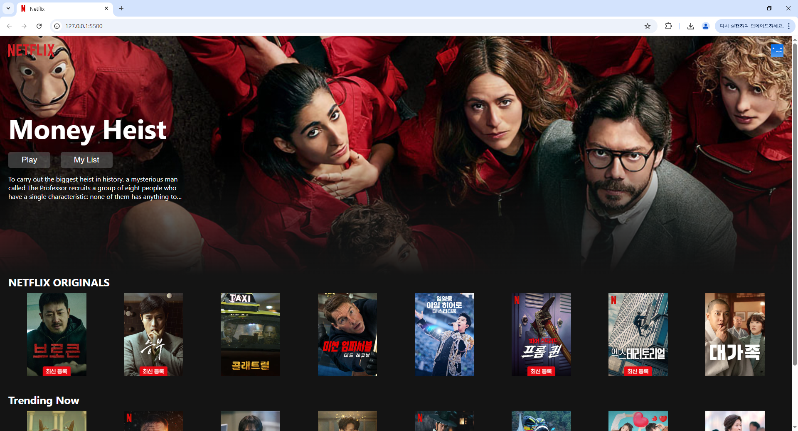
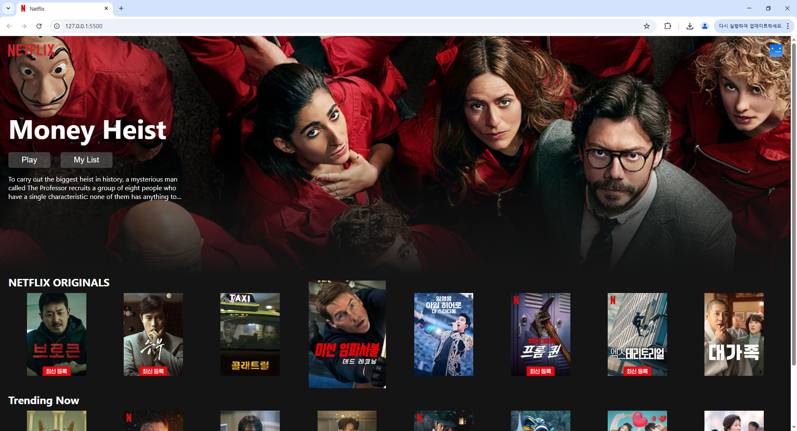

# 넷플릭스 클론 프로젝트

---

## 💡 프로젝트 개요

이 프로젝트는 **HTML5와 CSS3**를 사용하여 인기 스트리밍 서비스인 넷플릭스의 핵심적인 레이아웃과 디자인을 복제하는 개인적인 과제입니다. 특히, **Flexbox 또는 CSS Grid**를 활용하여 영화 및 TV 쇼 콘텐츠를 효과적으로 나열하고, **마우스를 호버했을 때(hover) 영화 이미지의 크기가 커지는 인터랙티브한 효과**를 구현하여 사용자 경험을 향상시키는 데 중점을 둡니다. 이 과제를 통해 웹 개발의 기본적이면서도 중요한 기술을 심도 있게 학습하는 것을 목표로 합니다.

## ✨ 주요 기능

* **반응형 레이아웃:** Flexbox 또는 CSS Grid를 사용하여 영화/TV 쇼 콘텐츠를 유연하게 배치하고, 다양한 화면 크기에 맞춰 레이아웃이 변경되도록 합니다.
* **영화/TV 쇼 나열:** 장르 또는 카테고리별로 영화/TV 쇼 포스터를 그리드 형태로 표시합니다.
* **호버(Hover) 효과:** 영화 이미지에 마우스를 올렸을 때 이미지의 크기가 부드럽게 확대되는 애니메이션 효과를 적용합니다.
* **기본 UI/UX 구현:** 넷플릭스의 시각적 아이덴티티를 모방하여 깔끔하고 직관적인 사용자 인터페이스를 구현합니다.

## 🚀 사용 기술

* **HTML5:** 웹 페이지의 구조와 콘텐츠를 정의합니다.
* **CSS3:** 웹 페이지의 스타일링과 레이아웃을 담당하며, 특히 **Flexbox 또는 CSS Grid**를 핵심적으로 활용합니다.

---

## ⚙️ 설치 및 설정

이 프로젝트는 순수 HTML, CSS로 이루어져 있어 별도의 복잡한 설치 과정이 필요하지 않습니다.

1.  저장소 복제:
    ```bash
    git clone [https://github.com/demian214/netflix-clone-project.git](https://github.com/demian214/netflix-clone-project.git)
    ```
2.  프로젝트 디렉토리로 이동:
    ```bash
    cd netflix-clone-project
    ```
3.  `index.html` 파일을 웹 브라우저에서 엽니다.

## 📸 스크린샷



### 이미지 호버시.


---

## 📈 프로젝트 진행 상황

* [x] 기본 HTML 구조 설계
* [x] CSS Reset 및 공통 스타일 설정
* [x] Flexbox 또는 CSS Grid를 이용한 영화 나열 레이아웃 구현
* [x] 영화 이미지 호버 시 확대 효과 구현
* [ ] (선택 사항) 간단한 상단 내비게이션 바 구현
* [ ] (선택 사항) 반응형 디자인 추가 개선

*(프로젝트 진행 상황에 따라 이 섹션을 업데이트하세요.)*

---

## 🤝 기여하기

기여는 오픈 소스 커뮤니티를 배우고, 영감을 주고, 창조하는 놀라운 공간으로 만듭니다. 여러분의 모든 기여는 **정말 감사합니다**.

더 나은 프로젝트를 위한 제안이 있다면, 저장소를 포크하고 풀 리퀘스트를 생성해주세요. "enhancement" 태그와 함께 이슈를 여는 것도 가능합니다.
프로젝트에 별을 주는 것을 잊지 마세요! 다시 한번 감사합니다!

1.  프로젝트 포크
2.  새 기능 브랜치 생성 (`git checkout -b feature/AmazingFeature`)
3.  변경 사항 커밋 (`git commit -m 'Add some AmazingFeature'`)
4.  브랜치에 푸시 (`git push origin feature/AmazingFeature`)
5.  풀 리퀘스트 열기

---

## 📄 라이선스

MIT 라이선스에 따라 배포됩니다. 자세한 내용은 `LICENSE` 파일을 참조하세요.

---

## 📧 연락처

정현명 - [hm.jung214@gmail.com](mailto:hm.jung214@gmail.com)

프로젝트 링크: [https://github.com/demian214/netflix-clone-project.git](https://github.com/demian214/netflix-clone-project.git)